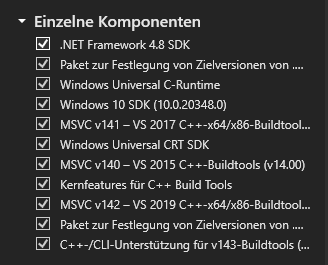
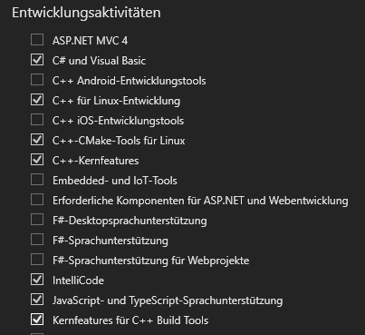
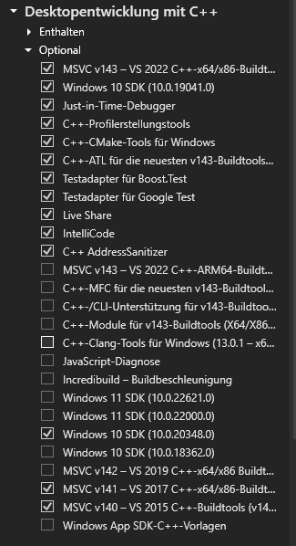
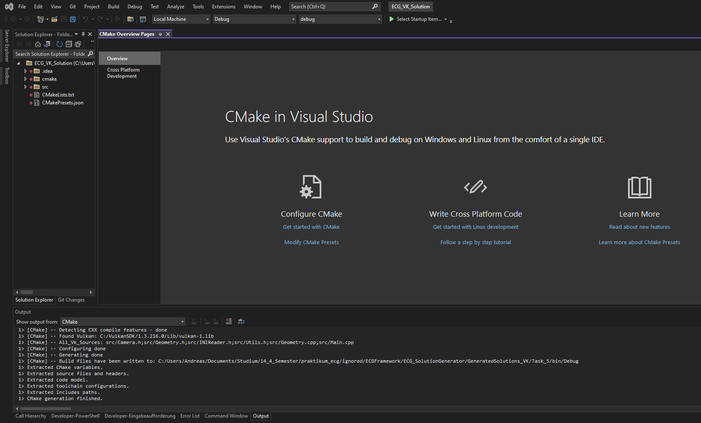
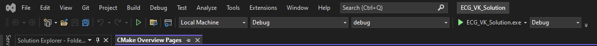
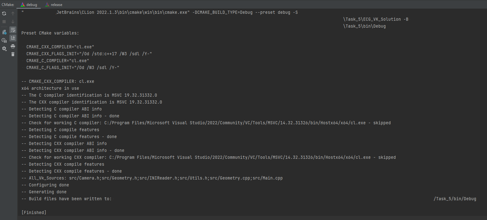
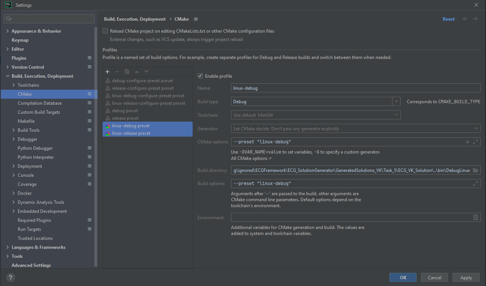
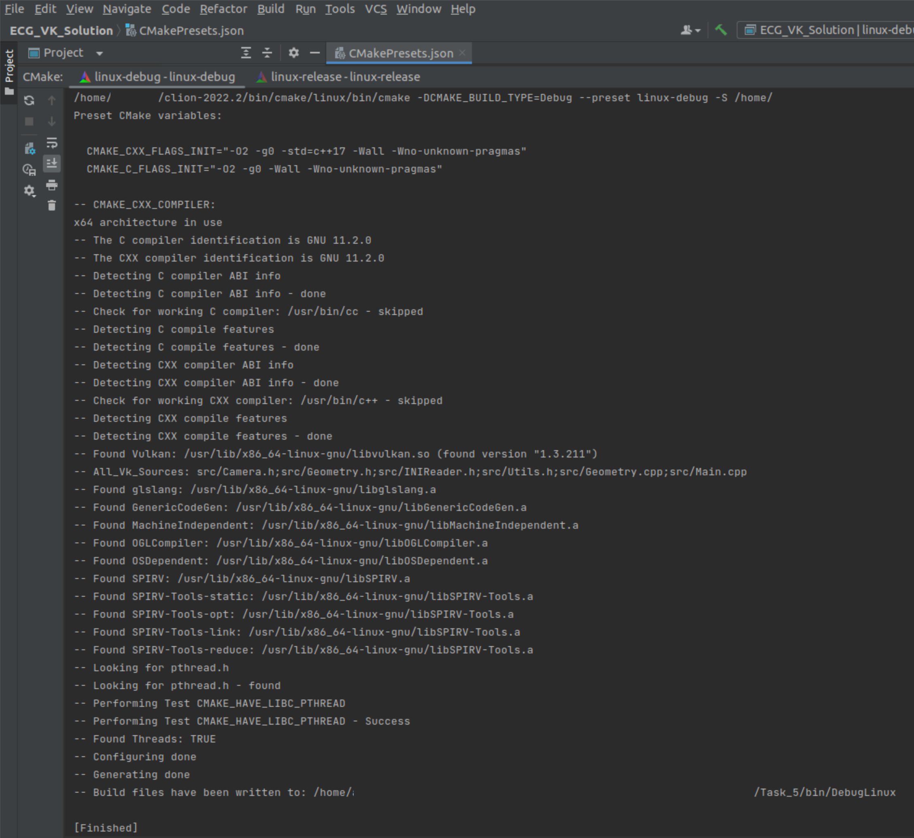

# Project Structure

The zip folder contains the following files and subfolders with the following purposes:

```
Task_X
├── assets
│   ├── shaders
│   │   ├── texture.frag
│   │   └── texture.vert
│   ├── textures
│   └── settings.ini
├── ECG_Solution
│   ├── cmake
│   │   ├── GlobalSettings.cmake
│   │   ├── LinuxDependencies.cmake
│   │   └── SourcesList.cmake
│   ├── src
│   │   └── The actual sources where you implement your solutions...
│   ├── CMakeLists.txt
│   └── CMakePresets.json
├── external
│   ├── include
│   ├── include_gli
│   └── lib
├── install_dependencies.sh
├── README.html
├── SubmissionTool.exe
├── version.txt
└── bin*
```

| Folder/File                         | Purpose                                                                                                                                                                                                                                                                                                                                                                                                                                                                                                                                                                                                                                                                    |
|-------------------------------------|----------------------------------------------------------------------------------------------------------------------------------------------------------------------------------------------------------------------------------------------------------------------------------------------------------------------------------------------------------------------------------------------------------------------------------------------------------------------------------------------------------------------------------------------------------------------------------------------------------------------------------------------------------------------------|
| `Task_X`                            | The root of the assignment folder. **Do NOT open this folder in your IDE!**                                                                                                                                                                                                                                                                                                                                                                                                                                                                                                                                                                                                |
| `assets`                            | Contains the textures and shaders. **The shaders might be relevant for your tasks and you might have to implement code here**                                                                                                                                                                                                                                                                                                                                                                                                                                                                                                                                              |
| `ECG_Solution`                   | **Contains the project!** Open **THIS** folder in your IDE and not the `Task_X` folder.                                                                                                                                                                                                                                                                                                                                                                                                                                                                                                                                                                                    |
| `ECG_Solution/CMakeLists.txt`    | This is the **project's root configuration** which can be loaded by Visual Studio, CLion or any other IDE of your choice (but beware we only tested it using the former two!) This can roughly be compared to a `.vcxproj` or `.sln` file                                                                                                                                                                                                                                                                                                                                                                                                                                  |
| `ECG_Solution/CMakePresets.json` | This contains machine-dependent configuration presets as well as compiler-selection and configuration types (i.e. `Debug` vs. `Release`). **You have to use this configuration!** How is explained in detail below.                                                                                                                                                                                                                                                                                                                                                                                                                                                        |
| `ECG_Solution/cmake`             | Contains additional helper files for CMake **but also the sources list**, meaning if you add new `.cpp` or `.h` files to your project, **you will also have to add them to `SourcesList.cmake`!                                                                                                                                                                                                                                                                                                                                                                                                                                                                            |
| `ECG_Solution/src`               | Contains the C sources of the project. Besides the shaders, this is the only other place where **your implementations will go**.                                                                                                                                                                                                                                                                                                                                                                                                                                                                                                                                           |
| `external`                          | Contains bundled library binaries and include directories of additional dependencies. You probably need not care about this folder.                                                                                                                                                                                                                                                                                                                                                                                                                                                                                                                                        |
| `install_dependencies.sh`           | **Only for Linux users:** You can run this script on your computer (under your own responsibility!) to automatically install all required packages, assuming your system runs on Ubuntu or a similar distribution with the `apt` package manager: Please carefully assess the script before running it and verify that you really want the commands to be executed. **BEWARE that the script modifies your installed graphics drivers by installing alternative, proprietary ones!** (This is needed on Linux systems in order to compile and run Vulkan applications) After that, you should have everything you need to be able to compile and run the project on Linux. |
| `SubmissionTool.exe`                | This tool collects your code and creates a zip file for upload. **Might be deprecated**                                                                                                                                                                                                                                                                                                                                                                                                                                                                                                                                                                                    |
| `bin`                               | This folder will be generated the first time the project is compiled and the executables will land here.                                                                                                                                                                                                                                                                                                                                                                                                                                                                                                                                                                   |

# Step by Step Project Setup

## Windows

**Note that we only tested this using `Visual Studio Community 2022 (64-bit), Version 17.2.6` on `Windows 10` with a `CMake 3.24` installation!**

For both, Visual Studio AND CLion, you need to install Visual Studio with the following packages:<br>




### Visual Studio

1. Open Visual Studio 2022 and select `Open a local folder`, this setting is for CMake projects.<br>
   
2. Navigate to your `Task_X/ECG_Solution` folder and select `ECG_Solution` to open it. The contained `CMakeLists.txt` will automatically be used by Visual Studio to load the project and the CMake configuration process is started immediately.
3. The CMake output should be visible automatically and should look like this, containing the line `1> CMake generation finished.`<br>
   
4. Now your Navigation Bar in Visual Studio should look like this.<br>
   
   Here you need to select `ECG_Solution.exe`:<br>
   
5. If you want to switch between `Debug` and `Release` mode, you have to find the right drop-down menu which provides this setting. Only one of the 3 `Debug` dropdown menus is the correct one:<br>
   
6. Now a click on the green triangle should build and run the program successfully.
7. Implement your tasks and upload the result.

### CLion

1. Install Visual Studio with the packages from the screenshots above (yes this is needed because we use the Visual Studio Compiler, MSVC, instead of MinGW).
2. Open CLion and then open the folder `Task_X/ECG_Solution`, the same way as described in the Visual Studio steps.
3. CLion should immediately recognize the `CMakePresets.json` and prompt you with a popup window:
   First, delete the `Default` preset, then activate only the two presets `debug` and `release` so that your configuration looks like this and press `Apply`:<br>
   
   Note, that it might also look slightly different: Be careful to choose the presets where the `Build options` field is filled and not the other one.
6. CLion should now automatically run a CMake configuration in the background and you should be able to see the results in the CMake message window. This window can be found under `View -> Tool Windows -> CMake`.
   A successful configuration should look like this:<br>
   
7. You should now be able to simply choose from either `Debug` or `Release` in the dropdown menu of your CLion `Run/Debug configurations` on the top and press the green triangle to build and run the app.
   Note, that for `Task_0`, the program will crash on purpose because your implementation is needed before a visible window can be loaded.
8. After you finished your task, you can compare your results with the provided reference solution.
9. Upload your solution.

## Linux

**Note that we only tested this using `CLion 2022.2` with its bundled CMake (version `3.23.2`) on `Ubuntu 22.04`**

Carefully follow these steps in order to setup your environment to be able to build and run the assignments (steps 1 to 3 are only needed once):

1. Only read, do not execute, the provided `install_dependencies.sh` script and verify that you really are OK with the changes in this script.
If not, you might need to switch to a Windows computer, or find alternative solutions which fit your requirements.
2. Run the provided `install_dependencies.sh` in a terminal. This might take a while.
3. If the script was successful, the last lines in the terminal (i.e. the script's output) should look similar to this:<br>
   
or you can run `vulkaninfo` manually to verify that Vulkan was installed successfully (which does not mean that every dependency is also installed correctly, but the script will fail immediately if errors occur).
4. Now you can open the folder `ECG_Solution` with your IDE. We tested this step with CLion successfully, thus CLion is recommended. We cannot provide support for any other IDE on Linux.
5. Assuming the project has been opened in CLion, the first step is to activate the correct CMake presets:
CLion should immediately recognize the `CMakePresets.json` and prompt you with a popup window:
First, delete the `Default` preset, then activate only the two presets `linux-debug` and `linux-release` so that your configuration looks like this and press `Apply`:<br>
   
Note, that it might also look like this: Be careful to choose the presets where the `Build options` field is filled and not the other one:<br>
   
6. CLion should now automatically run a CMake configuration in the background and you should be able to see the results in the CMake message window. This window can be found under `View -> Tool Windows -> CMake`.
A successful configuration should look like this:<br>
   
7. You should now be able to simply choose from either `Debug` or `Release` in the dropdown menu of your CLion `Run/Debug configurations` on the top and press the green triangle to build and run the app.
Note, that for `Task_0`, the program will crash on purpose because your implementation is needed before a visible window can be loaded.
8. After you finished your task, you can compare your results with the provided reference solution. On linux, the executable might need to have additional rights before you can run the program:
If `./ECG_Solution` in a terminal or double clicking the file does not work, please try `chmod 755 ./ECG_Solution` beforehand and then try one of the first two actions again.
9. Upload your solution.

# FAQ / Common Erros

1. When opening the project folder with Visual Studio it will automatically load the CMakePresets.json.
However, there seem to be problems with some Visual Studio **Extensions**: Visual Studio might **freeze** on startup
randomly if it tries to load CMake settings while some extensions are active.
If this happens, all extensions which are not completely necessary should be deactivated in the
`Extensions -> Manage Extensions -> Installed` menu.
Then restart Visual Studio.